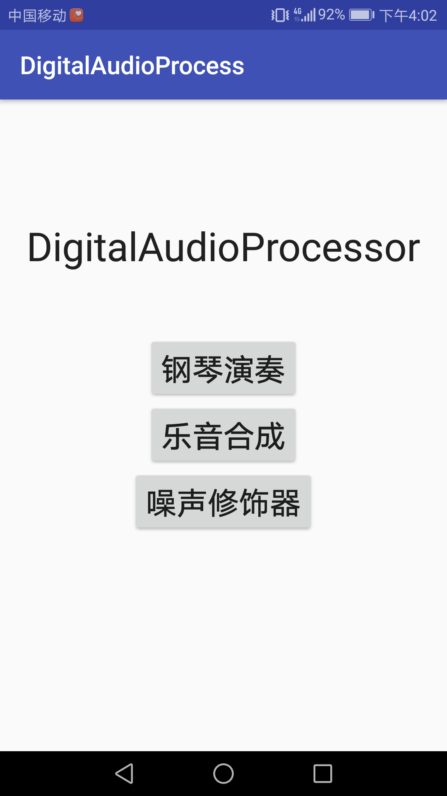
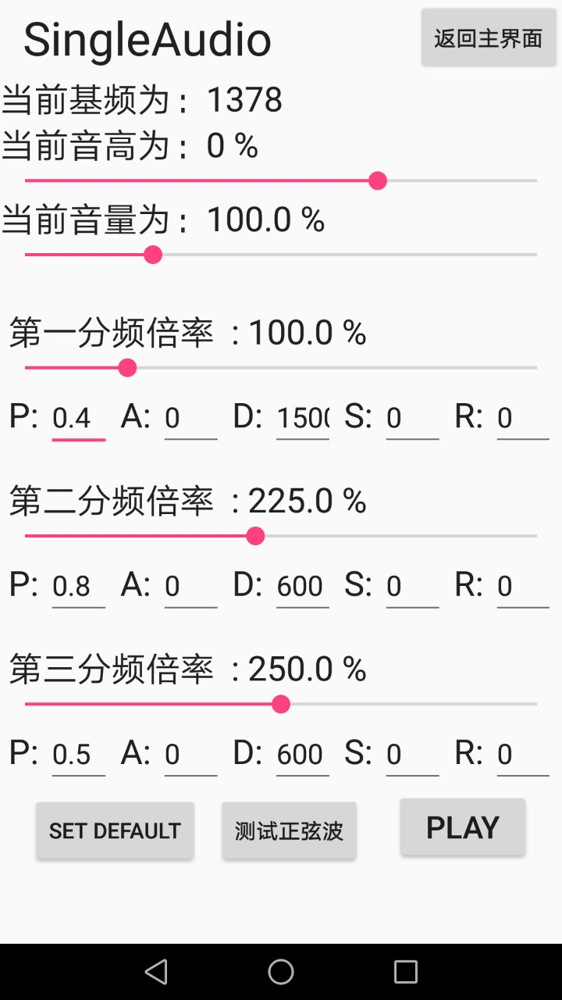
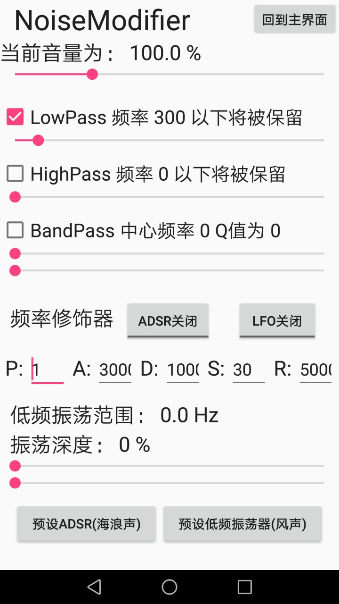

# Introduction
This is my assignment in Digital Audio Process and it can be installed in your Android phone. 
It includes following function:
1. Making the main frequence a fixed number with several sub-frequence. This allows you to generate sounds like knocking glass.
2. Generating a sound which is based on white noise, such as a wind-like or seawave-like sound. The sound can be modified with ADSR(Attack Decrease Sustain Release) or LFO(Low Frequency Oscillator)
3. The last function is playing piano by clicking screen, But this function does not be user-friendly. It, indeed, can play if running in the computer, but in the phone, it doesn't perform that exactly.

## 　　MainWindow　　　　　Function one.　　　　Function two.
　　

https://bajiaobujie.github.io/DigitalAudioProcessor/
